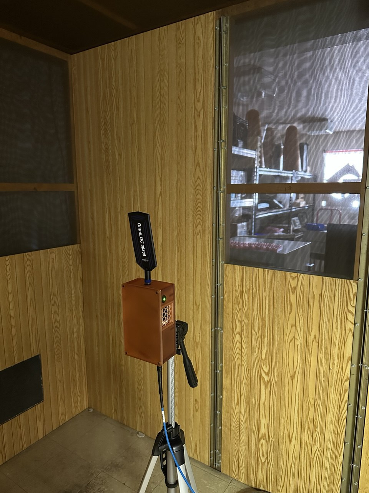

### First-Stage Amplifier Enclosure
This Enclosure is designed to house first-stage Mini-Circuits ZX60-14LN-S+ Amplifier, Bias-Tee and a Linear Voltage Regulator.

The Enclosure is designed to be mounted on a standard tripod mount, and has a 1/4" UNC thread on the bottom and back.

The Amplifier is powered via a 6V Linear Voltage Regulator, which has to be supplied by a 12V bias in the outgoing coaxial cable.

The Device was designed in AutoCAD Inventor 2025, all necessary design files can be found in this directory.

The Enclosure is designed to be 3D printed, the step files in the directory are ready to print (however the current enclosures where printed with sla and sls processes and fdm is not yet tested).

