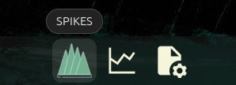
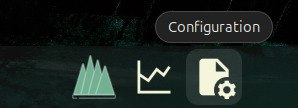
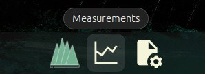
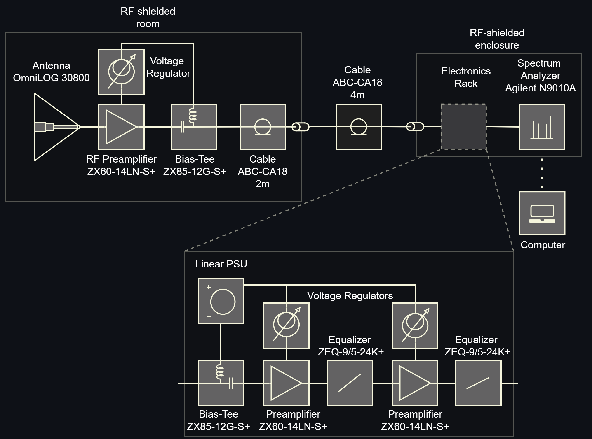

## SPIKES - Spectrum Plotter and Interface Kit for Emissions Scanning

SPIKES is a Test Setup to capture the emission profiles of potential RFI emitters at the Hat Creek Radio Observatory. 

The setup consists of a spectrum analyzer, a computer running the SPIKES application, an antenna and amplification system. 

The system is located in Lab 2 at HCRO, in this tutorial only local operation is covered. For more details on remote operation please refer to the documentation.

While it does not exceed the Github limit Measurement data should always be updated using git push to this repository (see Git_Push_Guide in the Documentation).

### Running the Application
To start the SPIKES application, log in to the Sonata account, navigate to the lower left side of the screen and click on the `SPIKES` icon:



Or for the computationally adept run the following command in your terminal:

```bash
spikes
```

### Configuration

You can create a configuration file for the desired measurement or reuse an existing one. 

To access the configuration files, click on the `Configuration` icon on the lower left side of the screen:



Again, for the experienced (or remote) user, the configuration files can be accessed directly from the terminal:

```bash
~/SPIKES/Configuration
```

Each configuration file contains the parameters to be sent to the spectrum analyzer, the parameters are loaded into the application and sent to the spectrum analyzer when the configuration is selected from the dropdown menu. 

If you edit or create a new configuration file, select RELOAD from the dropdown menu to update the current configuration files.

Note: there are two main modes of operation, `FAST` and `HIGH-RES`.

#### Example configuration (fast_track.yml):

FAST mode will perform a Max Hold measurement, this mode is useful to capture high-amplitude non-continous emissions like Wifi or Cellular.

In this example the spectrum analyzer will sweep from 300 MHz to 10 GHz with a resolution bandwidth of 500 kHz and a video bandwidth of 500 kHz. The attenuation is set to 10 dB to avoid damage to the spectrum analyzer (a strong signal is expected). The display will refresh every second and the integration time is set to 5 seconds. The total number of traces is set to 5.

This will result in a total measurement time of 25 seconds.

In this example the sweep time would be 45 milliseconds which will be displayed as soon as the configuration is loaded into the spectrum analyzer. This means that each trace will contain the max hold values of 111 sweeps. ($\frac{5 s}{0.045 s}$ = 111.1 = 111 sweeps) 

```yaml
sweep_points:       1001    # number of points
start_freq:         300e6   # Hz
stop_freq:          10e9    # Hz
res_bw:             500e3   # Hz
vid_bw:             500e3   # Hz
attenuation:        10      # dB
mode:               FAST    # Mode of operation: HIGH-RES or FAST
# mode specific parameters
display_refresh:    1       # seconds (int or float)
integration_time:   5       # seconds (integer)
total_traces:       5       # integer or "cont" for continuous operation
```

#### Example configuration (slow_coach.yml):

HIGH-RES mode will perform a clear sweep of the spectrum for every trace, this mode is useful to capture low-amplitude continuous emissions like clock signals or harmonics.

In this example the spectrum analyzer will sweep from 300 MHz to 6 GHz with a resolution bandwidth of 5 kHz and a video bandwidth of 5 kHz. The attenuation is set to 0 dB (a faint signal will be measured). The mode is set to HIGH-RES and the number of traces is set to 2.

The sweep time will be 264.233 seconds, which will result in a total measurement time of 9 minutes.

```yaml
sweep_points:   1001        # number of points
start_freq:     300e6       # Hz
stop_freq:      6e9         # Hz
res_bw:         5e3         # Hz
vid_bw:         5e3         # Hz
attenuation:    0           # dB 
mode:           HIGH-RES    # Mode of operation: HIGH-RES or FAST
# mode specific parameters
num_aver:       2           # number of traces
```

### Measurement Process
1. Select a configuration from the dropdown menu.
2. Click the Start button to begin the measurement.
3. The progress bar will update to show the measurement progress.
4. The Stop button can be used to stop the measurement at completion of the current trace.
5. The Save button will open a dialog to save the data to a file.

Please note that stopping a measurement will always wait on completion of the current trace, as the limitations of GPIB communications do not allow to reset the specturm analyzer during the sweep. 

It is still possible however to stop the measurement manually by pressing the ESC button on the spectrum analyzer to exit remote operation and setting the resolution bandwith very high to end the current measurement quickly (which will reestablish GPIB responsiveness of the spectrum analyzer). This will of course result in no data being captured.

### Measurement Data

To access the measurement data, click on the `Measurements` icon on the lower left side of the screen:



Or for the terminal savvy:

```bash
~/SPIKES/Measurements
```

The folder structure is automatically created and organized as follows:

```
Measurements
├── date[YYYY-MM-DD]
│   ├── time[HHhMM]-[config_name]
│   │   ├── data
│   │   │   ├── config file[config_name].yml
│   │   │   └── trace_n.csv
|   |   ├── imgs_legend
|   |   |   ├── combined_trace.png
|   |   |   └── trace_n.png
|   |   └── imgs_nolegend
|   |       ├── combined_trace.png
|   |       └── trace_n.png
```

for example:

`Measurements/2025-01-01/12h00-fast_track/data/trace_1.csv`

### Setup Schematic


